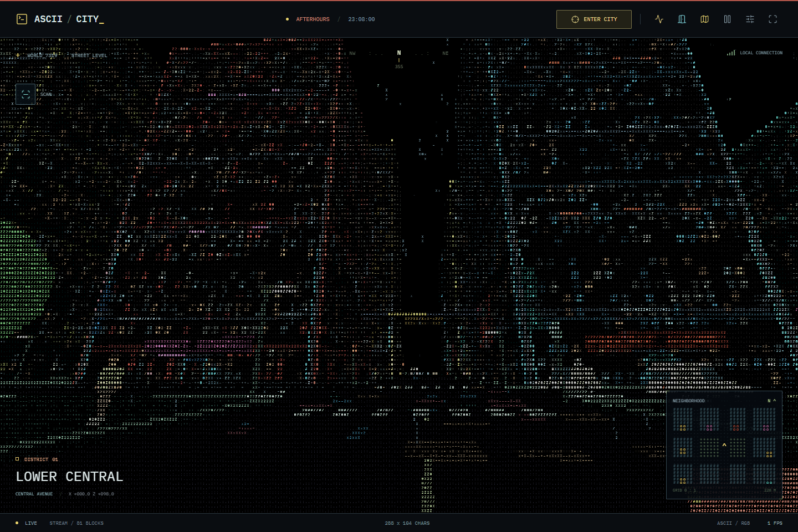
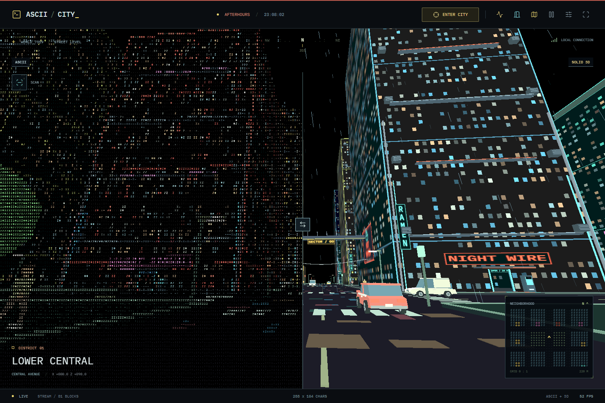
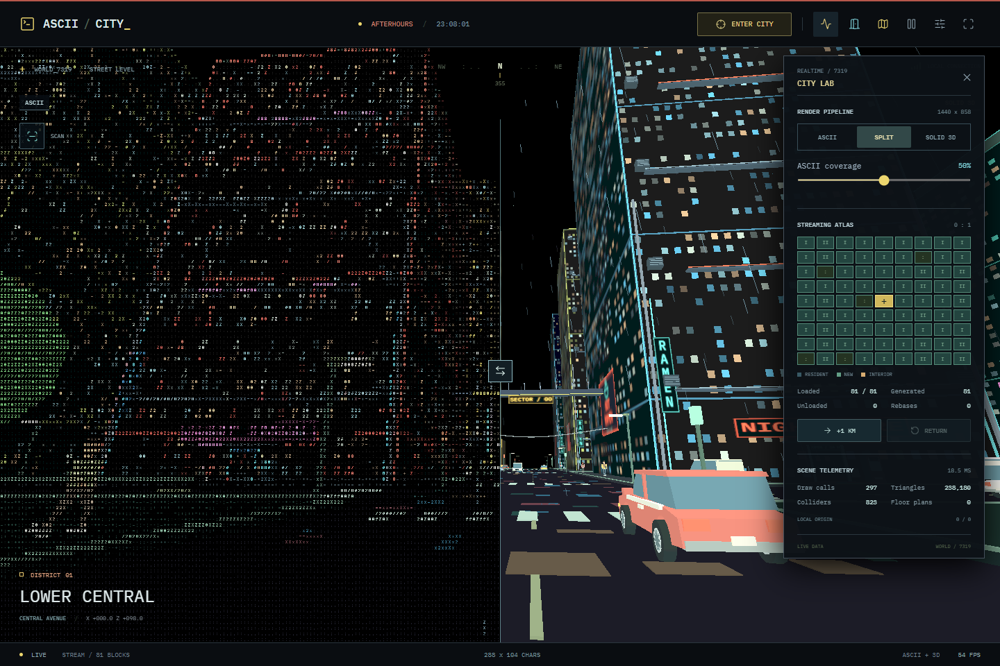
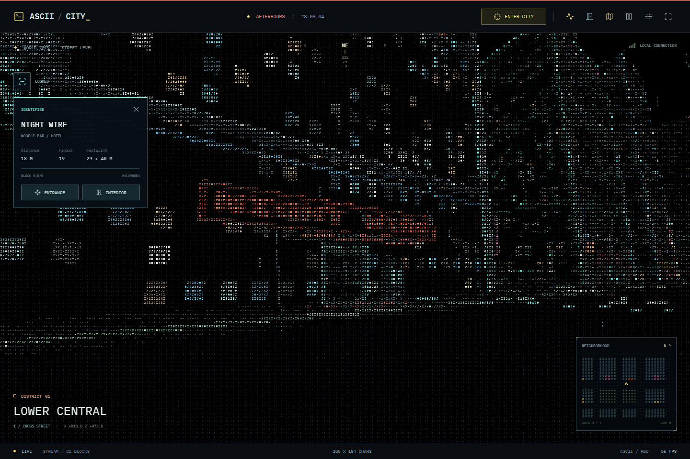
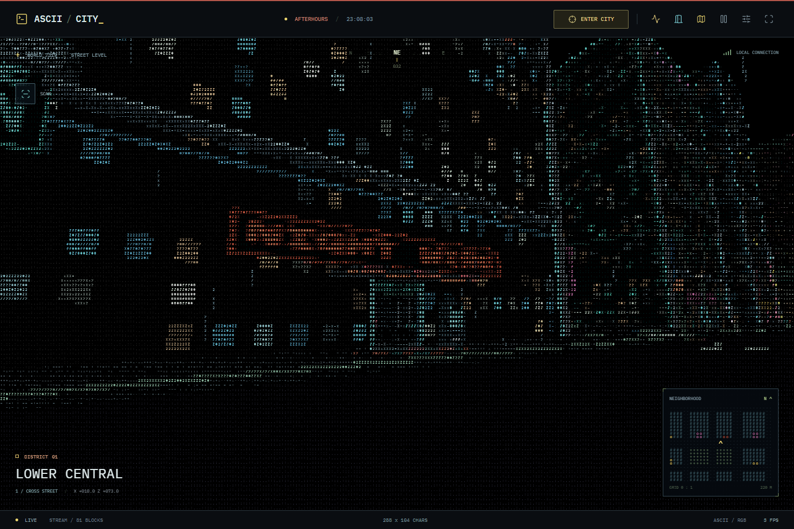
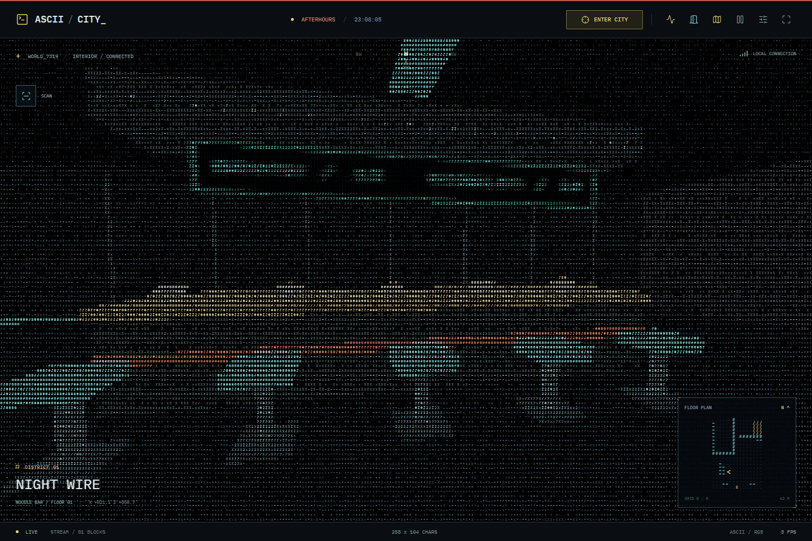
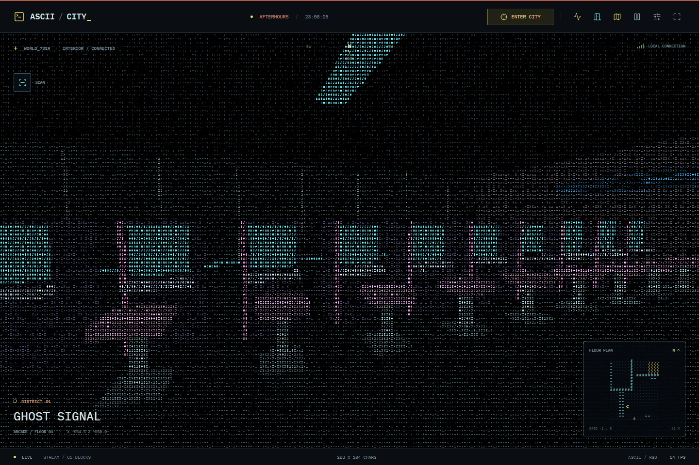
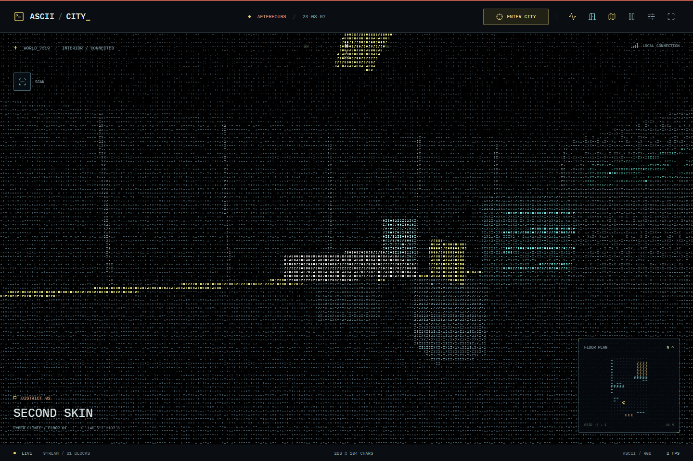
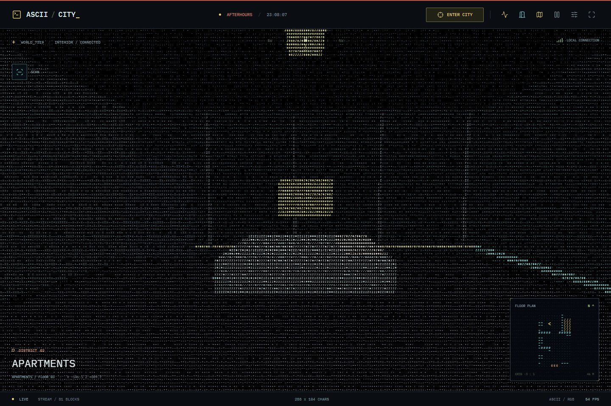
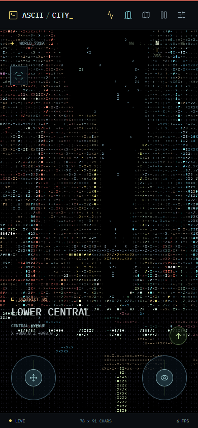

# Night City

### Walk the city. Reveal the simulation.

Walk past the last block. Another neighborhood appears. Follow the neon into a late-night noodle bar, climb the stairs to an apartment, or watch traffic disappear into the rain.

**Night City is a playable, first-person cyberpunk city rendered as colored characters on a black screen.** Not a screenshot filter or a looping animation: a real 3D world with collision, procedural interiors, animated street life, and somewhere else to go.

Now it is also a hands-on rendering and procedural-generation tech demo. Compare ASCII with the underlying solid 3D scene, watch blocks stream through a live atlas, and scan the architecture to explore what was generated.



**[Get started](#get-started) | [Try the tech demo](#try-the-tech-demo) | [Explore the interiors](#behind-the-neon) | [How it works](#under-the-characters)**

## Try the Tech Demo

Three experiments, all running on the same live city:

1. **Reveal the render pipeline.** Open **City Lab** using the waveform icon or `L`, then select **Split**. Drag the divider across the screen: one side is ASCII, the other is the actual solid 3D scene, with the same perspective, people, cars, and weather. Switch to **Solid 3D** to inspect the geometry or back to **ASCII** for the original look. Pause the city to compare a single frame.
2. **Watch the world stream.** The Lab's 9-by-9 atlas shows resident, newly generated, pending-render, and interior-loaded blocks. Click a block to inspect its building. Use **+1 KM** to jump to another neighborhood and see the generated/unloaded counters change while the resident count stays bounded, then **Return** to the previous position. Longer travel also exposes the floating-origin rebase counter.
3. **Scan a building, then go inside.** Aim at a facade and press `Q` or the scan icon. A ground sweep and building outline identify the nearest building along your view, revealing its venue, use, floor count, footprint, coordinates, and seed. **Entrance** takes you to the door; **Interior** opens that specific building, not a generic room.



| Live City Lab | Building Scanner |
| :---: | :---: |
|  |  |

The counters come from the running simulation and renderer: scene draw calls, triangles, resident colliders, loaded floor plans, and elapsed frame time. The atlas and scan use the generated world's data rather than a separate demonstration map. ASCII remains the default; solid and split views are optional inspection modes.

## Keep Walking

The city is generated around you, not bounded by a fixed map. Street widths, block dimensions, building footprints, and tower heights vary with their coordinates. Walk away, come back, and the same architecture is waiting.

- **An effectively endless city:** 81 nearby blocks stream in and out; distant geometry, textures, and colliders are released.
- **Street-level atmosphere:** original billboards, vertical neon signs, market stalls, service machinery, overhead utilities, rain, and wet-pavement light streaks.
- **A populated night shift:** 100 nearby pedestrians with articulated walking animation and 60 vehicles across sedans, taxis, wagons, and vans.
- **Cars with actual silhouettes:** sloped cabins, wheel arches, rotating wheels, windows, mirrors, bumpers, and lights. Traffic follows lanes, waits at signals, and leaves space ahead.
- **Desktop and touch:** mouse-look and keyboard movement, or dual touch joysticks. The same city, not a separate mobile demo.



## Behind the Neon

The buildings are not just scenery. Walk through the illuminated entrances, explore furnished rooms, and follow switchback stairs between floors. The HUD identifies your location; the minimap becomes an indoor floor plan.

For an immediate look inside, open the **door icon, Places / Interiors**, and choose a destination:

| Place | What is inside |
| --- | --- |
| **Night Wire** | A late-night noodle bar with a service counter, stools, bowls, and an extraction hood. |
| **Second Skin** | A cyber clinic with a treatment chair, diagnostics terminal, and illuminated cabinets. |
| **Ghost Signal** | An arcade lined with glowing cabinets and control decks. |
| **Low Frequency** | A neon lounge with a bar, glasses, seating, and booths where space allows. |
| **Residence** | An upstairs apartment with a bed, storage, and a connected route back downstairs. |

| Night Wire | Ghost Signal |
| :---: | :---: |
|  |  |

| Second Skin | Upstairs Residence |
| :---: | :---: |
|  |  |

Interiors are generated from the same seed as the building. Only nearby floors are loaded, so exploring another tower does not leave every room in memory. Rain stays outside.

## Get Started

Requires **Node.js 22.12+** and a browser with **WebGL2** support.

```sh
git clone https://github.com/willzjc/night-city.git
cd night-city
npm ci
npm run dev
```

Open the local URL printed by Vite. No backend, account, API key, or asset CDN is needed to run the simulation. Fonts are bundled locally; the city, signs, vehicles, and people are generated in code.

To build and preview a production bundle:

```sh
npm run build
npm run preview
```

## Controls

| Action | Input |
| --- | --- |
| Capture mouse | Click **Enter City** or the city view |
| Walk | `W` / `A` / `S` / `D` |
| Look | Mouse; left/right arrows also turn |
| Forward / backward | Up/down arrows also work |
| Run / jump | Hold `Shift` / press `Space` |
| Release mouse | `Escape` |
| Pause / resume | `P` or the pause button |
| Map | `M` or the map button |
| Reset position | `R` or **Display Config > Reset position** |
| City Lab | `L` or the waveform icon |
| Scan a building | `Q` or the scan icon |
| Inspect rendering | **City Lab > ASCII / Split / Solid 3D** |
| Compare both render modes | Drag the split divider or use **ASCII coverage** in the Lab |
| Jump / return | **City Lab > +1 KM / Return** |
| Visit an interior | Door icon > **Places / Interiors** |
| Return outside | **Places / Interiors > Return to street** |

On touchscreens, the left stick moves, the right stick looks, and the up-arrow button jumps. Drag-to-look also works when mouse capture is unavailable.

**Display Config** includes glyph size, full-color/green/amber palettes, phosphor glow, field of view, and a rain toggle. **Tour** follows a continuing route through new neighborhoods; manual movement takes over. Switching tabs pauses the simulation. Reduced-motion preferences disable rain by default and suppress head bob and the animated scan sweep while preserving the selected-building outline.

When mouse capture is active, press `Escape` to release it before clicking a scanner action. The scan button and Lab controls also work on touchscreens; selecting an atlas building closes the Lab on small screens to reveal its scan result.

<p align="center">
	
</p>

## Under the Characters

The aesthetic is deliberately old-school. The machinery underneath is not.

1. **Coordinate-seeded generation** produces stable street positions, varied blocks, building shells, and floor plans.
2. **Three.js** renders nearby architecture, signs, interiors, vehicles, and pedestrians to a small framebuffer.
3. **A GPU ASCII pass** samples that image and draws glyphs from a local font atlas, preserving perspective, color, and motion against black.
4. **Rapier** handles grounded walking, walls, furniture, curb stepping, jumping, and stairs using the same generated geometry.
5. **Streaming and a floating origin** keep the resident world bounded and local physics coordinates precise during long walks.

Night fog hides the rendering distance; it is not a physical city boundary. There is no generative-AI service or network request needed to invent the next block.

Solid and split modes use a larger framebuffer and share the same color transform as ASCII. Returning to ASCII restores its small render target. Scanner targeting uses Three.js ray/box intersections against building bounds; its world-space outline and sweep follow origin changes and clear when the selected building unloads.

| Area | Source |
| --- | --- |
| Streets, blocks, buildings | [src/layout.js](src/layout.js) |
| Neighborhood and floor streaming | [src/streaming.js](src/streaming.js) |
| Venue identities and furnished interiors | [src/venues.js](src/venues.js), [src/interiors.js](src/interiors.js) |
| World rendering and mesh lifecycle | [src/world.js](src/world.js), [src/mesh-batch.js](src/mesh-batch.js) |
| Pedestrians and traffic | [src/actors.js](src/actors.js) |
| Character physics | [src/physics.js](src/physics.js) |
| ASCII rendering and weather | [src/ascii.js](src/ascii.js), [src/weather.js](src/weather.js) |
| City Lab and building scan | [src/lab.js](src/lab.js), [src/scanner.js](src/scanner.js) |
| Controls, HUD, and application loop | [src/controls.js](src/controls.js), [src/ui.js](src/ui.js), [src/main.js](src/main.js) |

## Tested, Not Just Pictured

```sh
npm test
npm run test:browser
npm run build
```

The test suite covers deterministic generation, different block sizes, bounded streaming, crossing the former map edge, far-distance precision, revisiting unloaded neighborhoods, room entry, ascending and descending stairs, vehicle anatomy, pedestrian motion, and desktop/mobile controls.

[GitHub Actions](.github/workflows/ci.yml) runs the simulation tests, headless desktop/mobile browser tests, and production build on pushes and pull requests. The README's local links and committed PNG screenshots are checked too.

Playwright also checks actual canvas pixels and screenshots, every Places destination, indoor maps, rain, pause/resume, mouse capture, split-view pixel comparisons, scanner entry actions, and kilometer-jump/return telemetry. Windows uses installed Microsoft Edge by default; other platforms use Playwright Chromium:

```sh
npx playwright install chromium
```

Set `PLAYWRIGHT_CHANNEL` to override the browser and `CITY_PORT` to change the test server port. To regenerate the curated README images, start the app with `npm run dev -- --port 5176`, then run the following in another terminal:

```sh
npm run screenshots
```

Set `CITY_URL` to capture from a different local URL. Those images are real captures of the application, not concept art. The reusable capture script is in [tools/capture-screenshots.mjs](tools/capture-screenshots.mjs).

## Scope

Night City is an exploration simulation and technical playground, not a full RPG. There are no missions, combat, inventory, or save-game progression. Pedestrians and traffic are ambient, non-interactive actors; vehicles are not drivable and do not collide with the player. Wet-street lighting is stylized, not ray-traced reflection. The building scan is an inspector, not a hacking or combat system, and the solid view is a view of the procedural geometry rather than a photorealistic renderer.

Built with **Three.js**, **Rapier**, **Vite**, **Lucide**, **IBM Plex Mono**, and **Playwright**. Original procedural artwork and locations; no assets from Cyberpunk 2077 are used, and this project is not affiliated with CD PROJEKT.